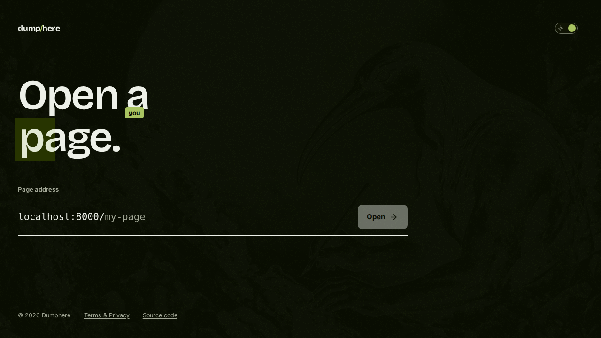

A public, collaborative Markdown editor where the URL path is the document.
Pick an address, share the link, and everyone writes together. There is no
sign-up and nothing to configure. Built with Laravel, Inertia, Vue, Tiptap and
Yjs.

Anyone who knows or guesses an address can read and edit it, and documents
untouched for 30 days are deleted. Keep anything sensitive, or anything you
cannot afford to lose, somewhere else.



## Architecture

- Laravel serves the application and persists the HTML representation of documents.
- The Yjs server synchronizes edits and persists snapshots to PostgreSQL.
- Rooms use the document's immutable UUID; the slug is only the public URL.
- IndexedDB provides a local/offline cache per UUID.
- The scheduler deletes documents untouched for more than 30 days, daily.

## Local development

Requirements: PHP 8.5+, Composer 2, Node 24 LTS, npm and Docker Compose.

Install dependencies once:

```bash
composer install
cp .env.example .env
php artisan key:generate
composer run setup
```

Set a random `YJS_WS_SECRET` in `.env` before starting. Then the whole
development environment comes up with a single command:

```bash
composer run dev
```

It starts PostgreSQL 18 through Compose, applies migrations, and runs Laravel,
Vite and the Yjs server directly on the host, all with automatic reload.

Then open:

- application: <http://localhost:8000>
- Vite/HMR: `localhost:5173`
- Yjs WebSocket: `localhost:1234`

Compose uses the conventional `DB_*` settings from `.env` and publishes
PostgreSQL on `127.0.0.1:${DB_PORT}`. There is no `.env.testing`: Pest loads the
same `.env`, and `phpunit.xml` isolates only the database, cache, session and
queue during tests.

Useful commands:

```bash
# Run the PHP suite
composer test

# Check the frontend (lint + format + types + tests + build)
npm run check

# PHP code style (Pint)
composer lint       # fixes
composer lint:test  # checks only, same as CI

# Frontend style and quality (ESLint + Prettier)
npm run lint        # fixes
npm run format      # fixes
npm run lint:test   # checks only, same as CI
npm run format:test

# Test the collaboration server
npm --prefix yjs-server test

# Start or stop PostgreSQL alone
composer run services
composer run services:stop
```

The `npm ci` in `composer run setup` installs the Husky pre-commit hook. On every
commit, `lint-staged` runs Pint on staged PHP files and ESLint + Prettier on
staged frontend files, fixing and re-adding the result. The same checks run in CI
in read-only mode. VS Code applies the same fixes on save, with settings shared
in `.vscode/settings.json` and recommended extensions in
`.vscode/extensions.json`.

When migrating an existing local PostgreSQL 17 volume to 18, do a dump/restore or
`pg_upgrade`. If the local data is disposable, you can recreate the volume with
`docker compose down -v`; that command permanently erases the local database. The
previous `md-online-editor_postgres_data` volume is not reused automatically and
stays preserved for an eventual migration.

### Version policy

The project tracks the current stable majors of PHP, Laravel, Inertia, Pest,
Vite, Node LTS and PostgreSQL. Two dependencies deliberately stay below the
highest published number:

- TypeScript 6 is the newest version compatible with the current `vue-tsc`;
- the server uses `y-websocket` 1.5 because the 3.x line removed the built-in
  server APIs; the client already uses `y-websocket` 3.

`@types/node` tracks the Node 24 runtime, not the Current 26 line.

## Deployment

- [docs/deploy.md](docs/deploy.md): the four processes and what the environment
  needs, on any host.
- [docs/deploy-forge.md](docs/deploy-forge.md): the worked Laravel Forge setup,
  with the Nginx, Supervisor and deploy-script configuration used in production.

Reserved addresses are granted by command, not bought:

```bash
php artisan prefix:grant acme
```

## Verification

```bash
composer test
vendor/bin/pint --test
npm run check
npm --prefix yjs-server test
composer audit --locked --no-dev
npm audit --omit=dev
npm --prefix yjs-server audit --omit=dev
```

## Forking and rebranding

The name comes from `APP_NAME` in `.env`, read by the frontend through
`VITE_APP_NAME`. Three things are not configurable and a fork replaces them
directly: the `Wordmark.vue` glyph, the images under `public/images/`, and the
terms text in `resources/js/i18n/locales/`, which describes one specific
deployment's policy and should not be copied verbatim.

## License

[AGPL-3.0-or-later](LICENSE). You can run, modify and redistribute this, but if
you offer a modified version to users over a network, you have to offer them its
source too. The footer link to this repository is what satisfies that for the
unmodified version; a fork points it at its own source in
`resources/js/Lib/appName.ts`.

Security reports go through [SECURITY.md](SECURITY.md), not public issues.
